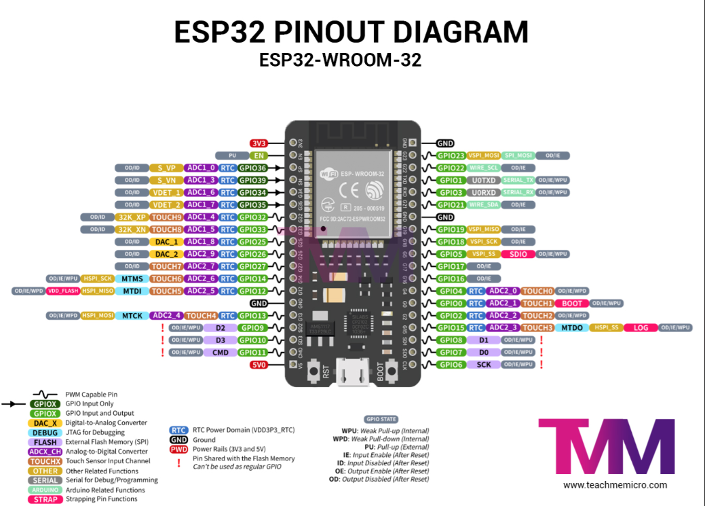

# DCC 101: Intro to Circuits & GPIO

## Project: Blink & Breathe — Your First ESP32 Circuit

Wire an LED, learn GPIO pins, and write your first Arduino sketch. Concepts: digital output, loops, PWM (dimming). The "Hello World" of hardware.

---

## Learning Objectives

By the end of this project, students will:
- Understand what GPIO pins are and how to control them
- Know the difference between digital ON/OFF and PWM (analog-like) output
- Write and upload their first sketch to an ESP32
- Understand duty cycle through a visible, tangible effect
- Build and transmit a real SOS signal in Morse code

---

## Equipment List

| Item | Qty | Approx Cost |
|------|-----|-------------|
| ESP32 Dev Board (38-pin) | 1 | $4–6 |
| LED (any color, 5mm) | 2–3 | $0.10 each |
| 220Ω resistor | 2–3 | $0.05 each |
| Breadboard (half-size) | 1 | $1–2 |
| Jumper wires (male-male) | 5–6 | — |
| USB-A to Micro-USB cable | 1 | — |
| Laptop with Arduino IDE installed | 1 | free |

**Total per student: ~$6–9**

> 💡 The 220Ω resistor protects the LED. Without it, too much current flows and the LED burns out instantly — a great teachable moment.

---

## The Circuit

```
ESP32 GPIO 2
     |
    [220Ω]
     |
    [LED+]  ← longer leg (anode)
    [LED-]  ← shorter leg (cathode)
     |
    GND
```

On a breadboard:

```
ESP32          Breadboard
GPIO 2  ──────── a1
GND     ──────── GND rail

Row 1:  a1 ── 220Ω ── d1
Row 1:  e1 ── LED(+)
Row 2:  LED(-) ── GND rail
```

> ⚠️ Always connect the resistor **before** the LED, between GPIO and LED+. Polarity matters — longer leg is positive.

---

## Part A — Basic Blink (Digital ON/OFF)

The simplest possible program. GPIO 2 goes HIGH (3.3V) then LOW (0V) with a delay in between.

```python
// PART A: Basic Blink
from machine import Pin
import time

LED_PIN = 18

led = Pin(LED_PIN, Pin.OUT)   # Set pin as output

print("Blink started!")

while True:
    led.value(1)              # ON
    print("LED ON")
    time.sleep(1)             # Wait 1 second

    led.value(0)               # OFF
    print("LED OFF")
    time.sleep(1)              # Wait 1 second
```

**What to observe:** LED blinks once per second. Open Serial Monitor (115200 baud) to see the messages print in sync with the blink.

**Challenge for students:** Change the delays. Make it blink fast (100ms). Make it blink slow (2000ms). What's the difference?

---

## Part B — Breathe (PWM Fade)

Now we make it *breathe* — smoothly fading in and out using PWM. This is the same concept that controls motor speed in later projects.

```python
// PART B: Breathe — PWM Fade
// ESP32 LEDC (LED Control) peripheral handles PWM
from machine import Pin, PWM
import time

LED_PIN  = 18
PWM_FREQ = 5000          # 5kHz — fast enough to look smooth
PWM_RES  = 255            # 8-bit equivalent → values 0 to 255

led = PWM(Pin(LED_PIN), freq=PWM_FREQ)

while True:
    # Fade IN — 0% to 100% brightness
    for brightness in range(0, 256):
        duty = int(brightness * 1023 / 255)   # scale 0-255 to ESP32's 10-bit duty (0-1023)
        led.duty(duty)
        print("Brightness:", brightness)
        time.sleep_ms(8)   # 8ms × 255 steps ≈ 2 seconds to full bright

    # Fade OUT — 100% to 0% brightness
    for brightness in range(255, -1, -1):
        duty = int(brightness * 1023 / 255)
        led.duty(duty)
        time.sleep_ms(8)
```

**What to observe:** LED gently pulses like breathing. Each full cycle (in + out) takes about 4 seconds.

**Key discussion:** Ask students — *is the LED really dimming, or is something else happening?* Lead them to discover PWM by looking at the LED through a phone camera while waving it quickly — they'll see individual pulses.

---

## Part C — SOS Morse Code Signal 🆘

Now students apply everything: digital output, timing, and pattern logic to transmit a real emergency signal.

### Morse Code Primer

```
Dot  (.)  = short flash = 1 unit
Dash (-)  = long flash  = 3 units
Gap between signals     = 1 unit (off)
Gap between letters     = 3 units (off)
Gap between words       = 7 units (off)

S = . . .
O = - - -
S = . . .
```

### Timing Chart

```
S         O            S
. . .     - - -        . . .
█ █ █     ███ ███ ███  █ █ █
```

```cpp
// PART C: SOS Morse Code Signal

#define LED_PIN 2

// Base time unit in milliseconds
#define UNIT 200

void setup() {
  pinMode(LED_PIN, OUTPUT);
  Serial.begin(115200);
}

// --- Helper functions ---

void dot() {
  digitalWrite(LED_PIN, HIGH);
  delay(UNIT);                   // ON for 1 unit
  digitalWrite(LED_PIN, LOW);
  delay(UNIT);                   // gap between signals
}

void dash() {
  digitalWrite(LED_PIN, HIGH);
  delay(UNIT * 3);               // ON for 3 units
  digitalWrite(LED_PIN, LOW);
  delay(UNIT);                   // gap between signals
}

void letterGap() {
  delay(UNIT * 2);               // extra 2 units (total 3 with signal gap)
}

void wordGap() {
  delay(UNIT * 6);               // extra 6 units (total 7 with signal gap)
}

// --- Letters ---

void sendS() {
  Serial.print("S");
  dot(); dot(); dot();
}

void sendO() {
  Serial.print("O");
  dash(); dash(); dash();
}

// --- SOS ---

void sendSOS() {
  Serial.println("\n--- SOS ---");
  sendS();  letterGap();
  sendO();  letterGap();
  sendS();
  wordGap();  // pause before repeating
}

void loop() {
  sendSOS();
}
```

**What to observe:** The LED flashes the internationally recognized SOS distress signal, repeating continuously. Serial Monitor prints "SOS" each cycle.

---

## Extend the Challenge

```cpp
// Change UNIT to speed up or slow down
#define UNIT 100   // faster — harder to read by eye
#define UNIT 400   // slower — easier to count

// Can you encode your own name?
// A = .-    B = -...   C = -.-.
// Look up the full Morse alphabet and spell your name!
```

---

## Session Plan (1 × 90 minutes)

| Time | Activity |
|------|----------|
| 0:00–0:15 | Intro — what is a GPIO pin? Show the ESP32 pinout diagram |
| 0:15–0:30 | Build the circuit on breadboard, learn resistor color codes |
| 0:30–0:45 | Upload Part A (Blink), explore Serial Monitor |
| 0:45–1:00 | Upload Part B (Breathe), discuss PWM — phone camera trick |
| 1:00–1:20 | Upload Part C (SOS), decode the flashes, encode their names |
| 1:20–1:30 | Debrief — where do you see blinking LEDs in real life? |

---

## Key Concepts Introduced

| Concept | Where it appears |
|---------|-------------------|
| GPIO output | Part A |
| `digitalWrite` | Part A |
| PWM / duty cycle | Part B |
| `ledcWrite` / LEDC | Part B |
| Functions & reuse | Part C |
| Timing & patterns | Part C |
| Serial Monitor | All parts |

---



## What Comes Next

DCC 102 (Smart Nightlight) builds directly on this — students add an **input** (LDR sensor) so the ESP32 *reads* the world instead of just acting on it. The LED from this project stays in the circuit.
