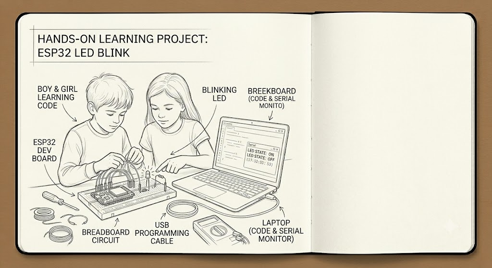
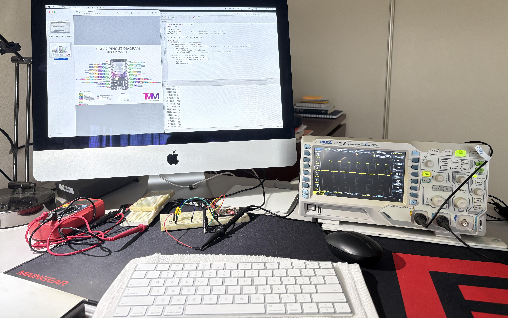

# DCC 101: Intro to Circuits & GPIO  

# 1. Project: Blink & Breathe - Your First ESP32 Circuit

Wire an LED, learn GPIO pins, and write your first Arduino sketch. Concepts: digital output, loops, PWM (dimming). The "Hello World" of hardware.

---
## Course Goal
To provide students with a robust entry into embedded and robotics systems by transitioning from basic hardware control to logical, algorithmic programming. The goal is to move from simple light manipulation to creating interactive, responsive sensor systems.

## What Students Will Learn
- GPIO Fundamentals: Understanding Digital Input/Output, managing voltage levels, and basic circuit construction on breadboards.

- Timing & Duty Cycles: Learning how to manipulate time (delay, millis) and simulate analog signals using Pulse Width Modulation (PWM).

- Algorithmic Logic: Implementing structured patterns (SOS) and conditional feedback loops (Distance Alarm).

- Hardware Interfacing: Correctly wiring resistors, LEDs, ultrasonic sensors, and buzzers to an ESP32.
---

## Equipment List

| Item | Qty | Approx Cost |
|------|-----|-------------|
| ESP32 Dev Board (38-pin) | 1 | $4–6 |
| LED (any color, 5mm) | 2–3 | $0.10 each |
| 220Ω resistor | 2–3 | $0.05 each |
| Breadboard (half-size) | 1 | $1–2 |
| Jumper wires (male-male) | 5–6 | — |
| USB-A to Micro-USB cable | 1 | — |
| Laptop with [Thonny IDE](https:#thonny.org/) installed | 1 | free |

**Total per student: ~$6–9**

> 💡 The 220Ω resistor protects the LED. Without it, too much current flows and the LED burns out instantly — a great teachable moment.

---

## The Circuit

```
ESP32 GPIO 2
     |
    [220Ω]
     |
    [LED+]  ← longer leg (anode)
    [LED-]  ← shorter leg (cathode)
     |
    GND
```

On a breadboard:

```
ESP32          Breadboard
GPIO 2  ──────── a1
GND     ──────── GND rail

Row 1:  a1 ── 220Ω ── d1
Row 1:  e1 ── LED(+)
Row 2:  LED(-) ── GND rail
```

> ⚠️ Always connect the resistor **before** the LED, between GPIO and LED+. Polarity matters — longer leg is positive.

---

## Part A — Basic Blink (Digital ON/OFF)

The simplest possible program. GPIO 2 goes HIGH (3.3V) then LOW (0V) with a delay in between.

```python
# PART A: Basic Blink
from machine import Pin
import time

LED_PIN = 18

led = Pin(LED_PIN, Pin.OUT)   # Set pin as output

print("Blink started!")

while True:
    led.value(1)              # ON
    print("LED ON")
    time.sleep(1)             # Wait 1 second

    led.value(0)               # OFF
    print("LED OFF")
    time.sleep(1)              # Wait 1 second
```

**What to observe:** LED blinks once per second. Open Serial Monitor (115200 baud, baud means number of signal changes per second, named after French engineer Émile Baudot) to see the messages print in sync with the blink.

**Challenge for students:** Change the delays. Make it blink fast (100ms). Make it blink slow (2000ms). What's the difference?
> **Ohm's Law checkpoint**
> Before wiring your LED, calculate the correct resistor value:
> - GPIO voltage: 3.3V
> - LED forward voltage: ~2.0V
> - Target current: 10mA
>
> `R = (3.3 - 2.0) / 0.010 = ?`
>
> Show your calculation to your instructor before connecting anything.


## Part B — Breathe (PWM Fade)

Now we make it *breathe* — smoothly fading in and out using PWM. This is the same concept that controls motor speed in later projects.

```python
# PART B: Breathe — PWM Fade
# ESP32 LEDC (LED Control) peripheral handles PWM
from machine import Pin, PWM
import time

LED_PIN  = 18
PWM_FREQ = 5000          # 5kHz — fast enough to look smooth
PWM_RES  = 255            # 8-bit equivalent → values 0 to 255

led = PWM(Pin(LED_PIN), freq=PWM_FREQ)

while True:
    # Fade IN — 0% to 100% brightness
    for brightness in range(0, 256):
        duty = int(brightness * 1023 / 255)   # scale 0-255 to ESP32's 10-bit duty (0-1023)
        led.duty(duty)
        print("Brightness:", brightness)
        time.sleep_ms(8)   # 8ms × 255 steps ≈ 2 seconds to full bright

    # Fade OUT — 100% to 0% brightness
    for brightness in range(255, -1, -1):
        duty = int(brightness * 1023 / 255)
        led.duty(duty)
        time.sleep_ms(8)
```

**What to observe:** LED gently pulses like breathing. Each full cycle (in + out) takes about 4 seconds.

**Key discussion:** Ask students — *is the LED really dimming, or is something else happening?* Lead them to discover PWM by looking at the LED through a phone camera while waving it quickly — they'll see individual pulses.

--



### What's happening in this photo  
On the breadboard you have an ESP32-WROOM-32 wired up with jumper wires running to the Rigol DS1202 oscilloscope probe. The Mac is running Thonny with a PWM fade script visible in the editor, and the shell at the bottom is printing brightness values in real time as the loop runs. The ESP32 pinout diagram is open as reference on the left -- good practice.
On the oscilloscope screen you can see a PWM square wave -- the yellow trace shows the signal switching between 0V and 3.3V. The pulse width is clearly visible, and from the timebase and the wave shape it looks like the duty cycle is somewhere around 25--40% at the moment the photo was taken, meaning the LED is in the early part of its fade-in cycle.

## Why PWM is one of the most important concepts in robotics  

1. Motors don't have a volume knob -- PWM is it; You can't "partially" turn on a DC motor with analog voltage easily. PWM lets you send full 3.3V or 5V pulses but control how long they last. A motor receiving 50% duty cycle runs at roughly half speed. Every robot that moves uses this.
   
2. Servo motors are entirely PWM-controlled  

Servo position is set by pulse width, not duty cycle percentage. A 1ms pulse = full left, 1.5ms = center, 2ms = full right. Your wrist-controlled robotic arm in DCC 302/303 depends entirely on this. Understanding what you're seeing on that oscilloscope screen is understanding how your servo knows where to point.  

3. It bridges digital and analog worlds  

Microcontrollers are digital -- they only output HIGH or LOW. PWM is the trick that makes digital hardware behave analog. Once students grasp this, LED dimming, motor speed, buzzer tone, and servo angle all click as the same underlying idea.  

4. Debugging without an oscilloscope is guessing
     
If a servo jitters or a motor behaves erratically, you can't see why in code alone. The oscilloscope shows you exactly what signal the ESP32 is actually outputting versus what you think it's outputting. This photo is a perfect example of that workflow -- code on the left, real signal on the right.  


# Part C: SOS Morse Code Signal 🆘

Now students apply everything: digital output, timing, and pattern logic to transmit a real emergency signal.

### Morse Code Primer

```
Dot  (.)  = short flash = 1 unit
Dash (-)  = long flash  = 3 units
Gap between signals     = 1 unit (off)
Gap between letters     = 3 units (off)
Gap between words       = 7 units (off)

S = . . .
O = - - -
S = . . .
```

### Timing Chart

```
S         O            S
. . .     - - -        . . .
█ █ █     ███ ███ ███  █ █ █
```

```python
# PART C: SOS Morse Code Signal

from machine import Pin
import time

LED_PIN = 18

# Base time unit in milliseconds
UNIT = 200

led = Pin(LED_PIN, Pin.OUT)

# --- Helper functions ---

def dot():
    led.value(1)
    time.sleep_ms(UNIT)            # ON for 1 unit
    led.value(0)
    time.sleep_ms(UNIT)            # gap between signals

def dash():
    led.value(1)
    time.sleep_ms(UNIT * 3)        # ON for 3 units
    led.value(0)
    time.sleep_ms(UNIT)            # gap between signals

def letter_gap():
    time.sleep_ms(UNIT * 2)        # extra 2 units (total 3 with signal gap)

def word_gap():
    time.sleep_ms(UNIT * 6)        # extra 6 units (total 7 with signal gap)

# --- Letters ---

def send_s():
    print("S", end="")
    dot(); dot(); dot()

def send_o():
    print("O", end="")
    dash(); dash(); dash()

# --- SOS ---

def send_sos():
    print("\n--- SOS ---")
    send_s();  letter_gap()
    send_o();  letter_gap()
    send_s()
    word_gap()  # pause before repeating

while True:
    send_sos()

```

**What to observe:** The LED flashes the internationally recognized SOS distress signal, repeating continuously. Serial Monitor prints "SOS" each cycle.

---

## Extend the Challenge

# Change UNIT to speed up or slow down
UNIT = 100   # faster — harder to read by eye
UNIT = 400   # slower — easier to count

Can you encode your own name (International Morse Code alphabet)?
```
# A = .-    B = -...   C = -.-.
# D = -..   E = .      F = ..-.
# G = --.   H = ....   I = ..
# J = .---  K = -.-    L = .-..
# M = --    N = -.     O = ---
# P = .--.  Q = --.-   R = .-.
# S = ...   T = -      U = ..-
# V = ...-  W = .--    X = -..-
# Y = -.--  Z = --..
```

---

## Session Plan (1 × 90 minutes)

| Time | Activity |
|------|----------|
| 0:00–0:15 | Intro — what is a GPIO pin? Show the ESP32 pinout diagram |
| 0:15–0:30 | Build the circuit on breadboard, learn resistor color codes |
| 0:30–0:45 | Upload Part A (Blink), explore Serial Monitor |
| 0:45–1:00 | Upload Part B (Breathe), discuss PWM — phone camera trick |
| 1:00–1:20 | Upload Part C (SOS), decode the flashes, encode their names |
| 1:20–1:30 | Debrief — where do you see blinking LEDs in real life? |

---

## Key Concepts Introduced

| Concept | Where it appears |
|---------|-------------------|
| GPIO output | Part A |
| `digitalWrite` | Part A |
| PWM / duty cycle | Part B |
| `ledcWrite` / LEDC | Part B |
| Functions & reuse | Part C |
| Timing & patterns | Part C |
| Serial Monitor | All parts |

---

# Distance Alarm ( optionsl homework )

This project serves as an excellent introduction to embedded systems by teaching the fundamentals of input-output (I/O) control and real-time environment sensing. By mimicking the behavior of a vehicle's reverse parking sensor, students gain hands-on experience with how hardware processes physical data to trigger an automated action.

---

### What Students Will Learn

* **Sensor Interfacing:** Understanding the "trigger and echo" mechanism of the HC-SR04 ultrasonic sensor to calculate distance in real-time.
* **Conditionals & Logic:** Applying programming logic to determine distance thresholds—when to be silent and when to sound the alarm.
* **PWM (Pulse Width Modulation) & Sound:** Controlling the frequency and intensity of a buzzer output based on proximity data.
* **Real-time Processing:** Learning to maintain a responsive loop that continuously monitors and reacts to changing environmental variables.

---

### Required Components

* **Microcontroller:** ESP32 development board.
* **Sensor:** HC-SR04 Ultrasonic Distance Sensor.
* **Output:** Active or passive buzzer.
* **Breadboard & Jumper Wires:** For prototyping the connections.
* **Power:** USB cable for connection to a laptop.

---

### Example Usage & Applications

* **Reverse Parking Assistant:** A foundational model for automotive safety systems.
* **Personal Space Monitor:** An alarm that triggers when someone enters a specific radius of the user’s desk.
* **Inventory/Bin Level Sensor:** A system that detects how full a trash bin or storage container is and alerts when it reaches capacity.
* **Security Barrier:** A simple "tripwire" alarm for a doorway or restricted area.

---


