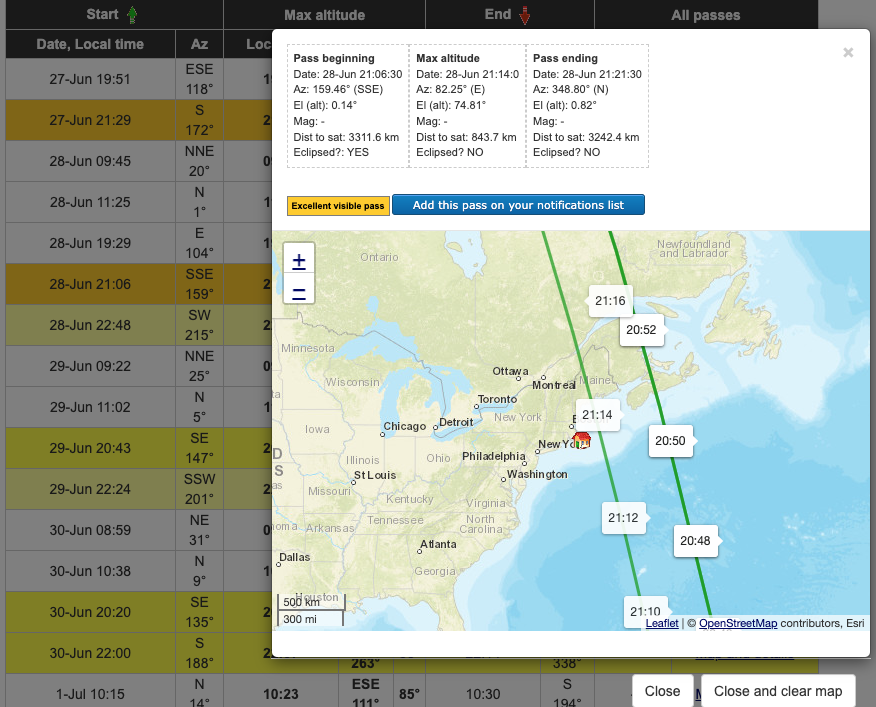
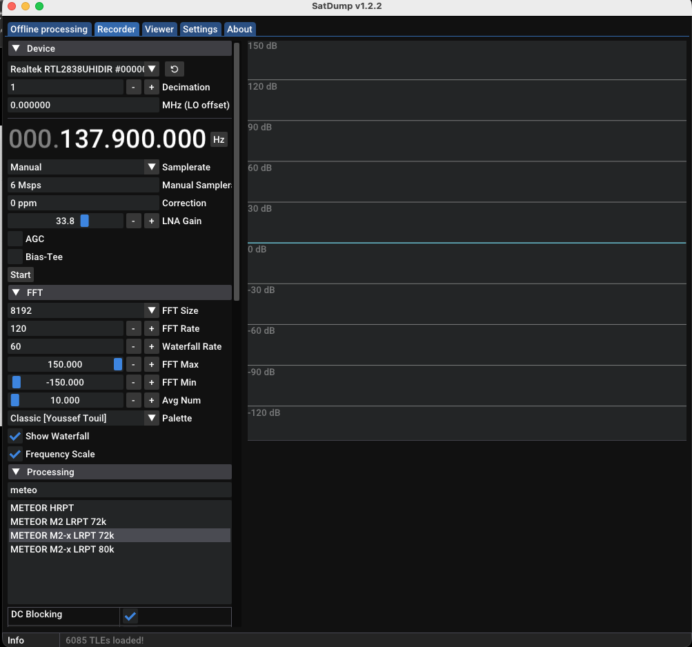
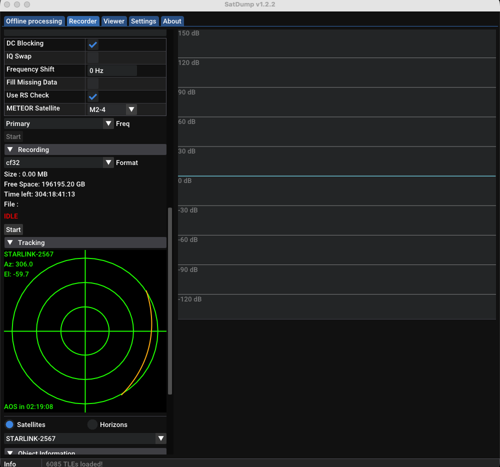
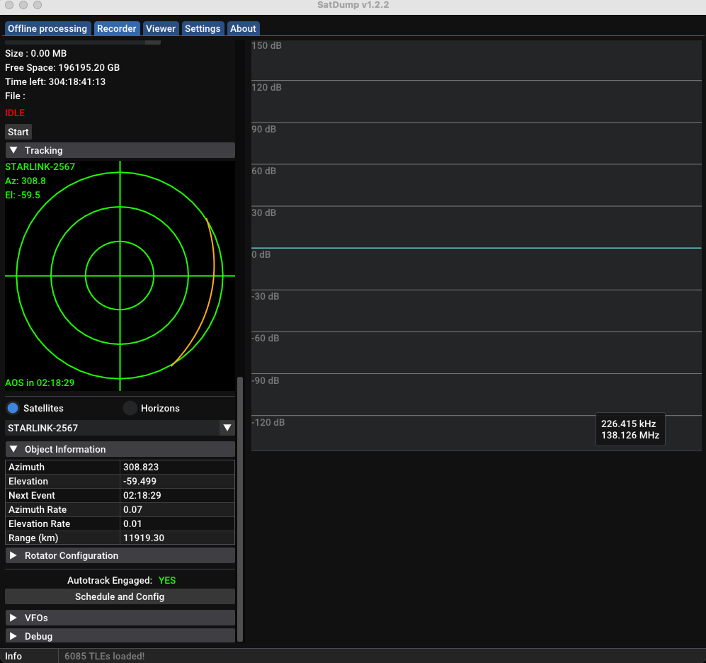
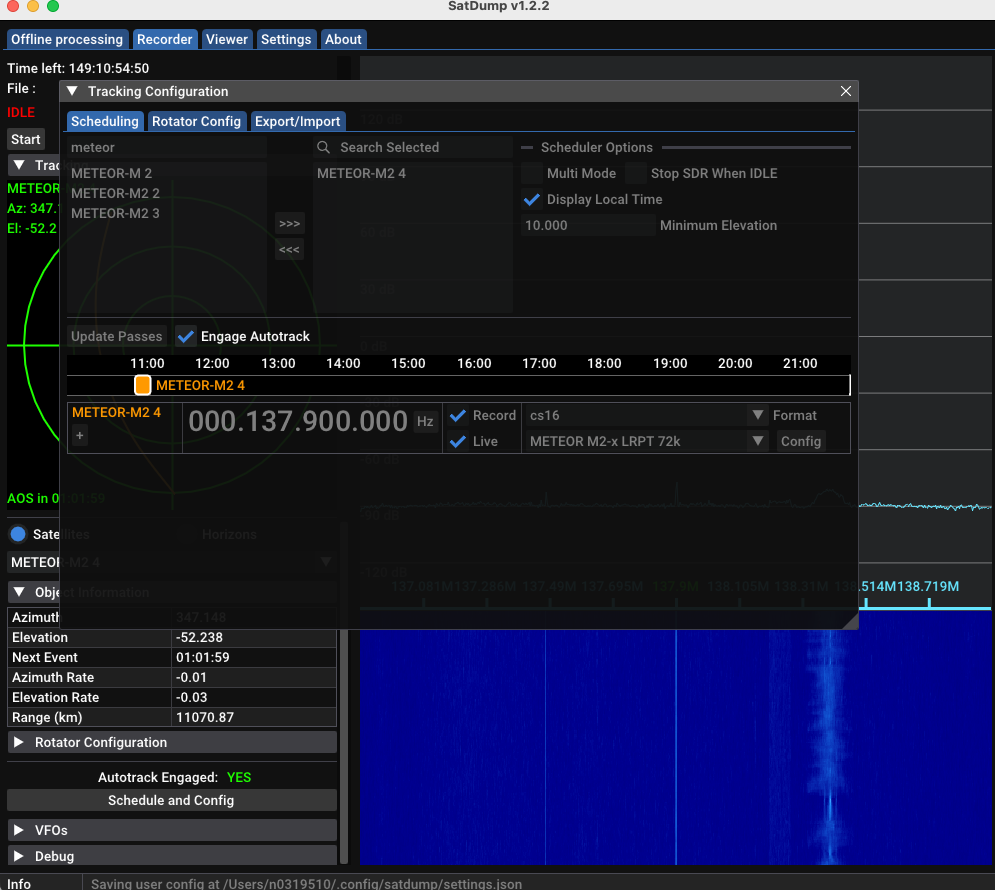
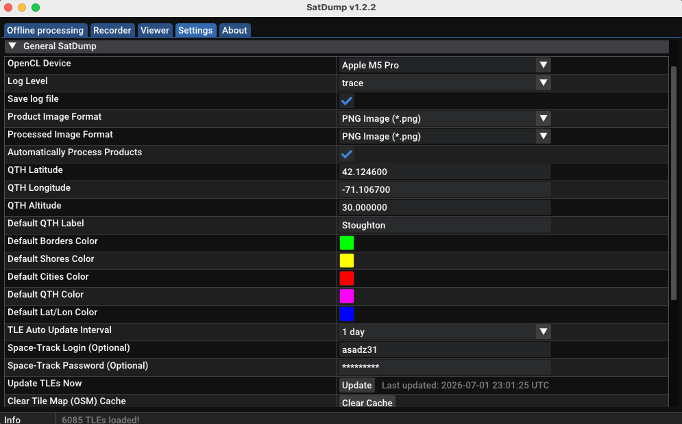

# SDR: Software Defined Radio  

With an SDR, your computer becomes a **window into the invisible world around you**. You can detect signals when someone nearby presses a car key fob or opens a garage door, track aircraft and satellites flying over your hometown, listen for the International Space Station as it passes overhead at around 17,500 mph, receive weather data or images from satellites like the Russian Meteor weather satellite, or simply listen to FM radio without using a traditional radio — and much more.


Introducing students to Software Defined Radio (SDR) is a fantastic way to turn abstract physics concepts into tangible, "radio-magic" experiences. By using a dongle to visualize invisible signals, students learn that radio is simply signal processing.  


### Course Goal

To demystify the electromagnetic spectrum by moving from theoretical radio waves to hands-on signal capture and decoding. Students will transition from being passive consumers of radio technology to active observers and analysts of the signals that fill the space around them.

### What Students Will Learn

* **The Radio Pipeline:** Understanding the core flow: **Antenna (Physical) → SDR Dongle (Digitization) → Software (Processing/Demodulation).**
* **The Electromagnetic Spectrum:** Learning how different applications—from car fobs to space stations—occupy specific frequency bands.
* **Spectrum Analysis:** Reading a "Waterfall" display to identify signals by their visual patterns (e.g., broad FM bands vs. sharp, pulsed data packets).
* **Signal Demodulation:** How to translate digital data or frequency shifts into usable information like audio or images.

---

### Project Demos: Hands-on Exploration

#### 1. Capture a Remote Control (Car Key Fob)

* **Concept:** Digital pulse encoding and On-Off Keying (OOK).
* **Experience:** Students will open their SDR software, find the approximate frequency (usually 315MHz or 433MHz), and watch for the sharp, short-duration "bursts" of data when they press a button on a remote.
* **Lesson:** This demonstrates how digital information is sent wirelessly in brief, structured packets.

#### 2. Capture an FM Radio Station

* **Concept:** Frequency Modulation (FM).
* **Experience:** By tuning into a strong local FM station, students can see the bandwidth (approx. 200kHz) and visualize the "sidebands" of the signal.
* **Lesson:** This is the best way to bridge the gap between RF signals and audible sound, proving that radio is just a wave carrying information.

#### 3. Familiarization with CubicSDR

* **UI/UX Exploration:** Students will learn to navigate the **Main Spectrum** (the "live" view of current frequency activity) and the **Waterfall** (a time-lapse view of past activity).
* **Key Skills:** Tuning center frequency, adjusting gain (to see signals hidden in the noise), and creating "modems" to isolate specific channels for listening.

---

### Homework: Advanced Signal Hunting

* **Capturing the ISS:** The International Space Station often transmits Slow Scan Television (SSTV) or data packets. Students must use an ISS tracker to predict when the station is overhead, then manually tune their receiver to follow the frequency shift caused by the Doppler effect as the station moves rapidly across the sky.
  use free edition of [ISS Detector](https://apps.apple.com/br/app/iss-detector/id1198597805?l=en-GB) to get time for next flyby over your location and elevation.
  Remember your location is always drifting towards east (360 / 24) * 1.5  ~ 22.5 degree
* **NOAA Weather Maps:** NOAA satellites transmit images as they orbit. This exercise teaches students about "data pipes"—how a high-frequency radio signal can be recorded as audio and then processed by software (like WXtoImg) to render a live, high-resolution image of the clouds over their current location.

[SatDump](https://www.satdump.org/getting-started/)  
   OR
`brew install --cask satdump`  

Use free [n2yo](https://n2yo.com) site in browser  
search:  
[Meteor-M2-3](https://www.n2yo.com/satellite/?s=57166)  
[METEOR M2-4](https://www.n2yo.com/satellite/?s=59051)  
set location, read the passes, which always has current satellites!   

`Meteor-M2-3`: Downlink (MHz): 137.100/137.900* (Mode: 72K*/80K LRPT)  
`Meteor-M2-4`: Downlink (MHz): 137.100/137.900*  (Mode: 72K*/80K LRPT HRPT)  


* Note: All three legacy NOAA APT satelliten(15, 18, 19) are now decommissioned (August 19, 2025)
  
---

# APPENDIX
### Catching a Picture From Space: Meteor-M2-4 with SatDump

A hands-on guide for the DCC-500 SDR module. By the end of this, you will have pulled a real weather image out of the sky using a tiny SDR radio.

> **Big idea:** A weather satellite the size of a fridge is flying 500 miles (800 km) over your head, taking pictures of clouds, and shouting them down as radio. We are going to listen, write down what it says, and turn that into a picture. **No internet involved** in the catch.

**Just you, an antenna, and physics.**

---

## What You Need

| Item | What it is | Kid-friendly version |
| --- | --- | --- |
| RTL-SDR dongle | A USB radio receiver (NooElec or RTL-SDR Blog v3/v4) | The "ears" that hear radio colors |
| 137 MHz antenna | A V-dipole or QFH tuned for 137 MHz | The "satellite dish," just shaped like a V |
| Laptop (Mac is fine) | Runs SatDump | The "brain" that reads the message |
| 137 MHz SAW filter + LNA (optional but great) | A booster marked **1581** | A "hearing aid" that cuts out city noise |
| Pass-prediction app | n2yo, Look4Sat, or ISS Detector | The "TV guide" that says when the show starts |

> **Antenna note:** A V-dipole is two metal rods about 52 cm to 53 cm each, spread into a wide V (around 120 degrees), pointed up at the sky. Cheap to build, works great.

---

## Step 0: Install SatDump

On Mac, the fastest way:

```bash
# Install SatDump on macOS using Homebrew
brew install --cask satdump   # downloads and installs the SatDump app
```

Or download the installer from <https://www.satdump.org/download/>.

---

## Step 1: Update the Satellite "Map" (TLEs)

The app needs to know where the satellite is. It learns this from small orbit files called TLEs.

1. Open SatDump.
2. Go to **Settings**.
3. Find the **TLE** section and click **Update**. (This one step needs internet.)

> **Analogy:** TLEs are the satellite's bus schedule. If your schedule is old, you will stand at the bus stop at the wrong time.

---

## Step 2: Find Out When Meteor-M2-4 Flies Over

The satellite is only in range for about 10 to 15 minutes per pass, so timing is everything.

- Open <https://n2yo.com> and search **METEOR M2-4** (NORAD 59051).
- Set your location, then read the **passes** list.
- Pick a pass with **maximum elevation above 25 degrees**. Higher is better. A pass that only reaches 10 degrees will be weak and frustrating.

You are looking for three numbers per pass:
- **AOS** (Acquisition Of Signal): when it rises. This is your "press Start" time.
- **Max elevation**: how high it gets. Higher equals stronger.
- **LOS** (Loss Of Signal): when it sets. This is your "press Stop" time.

> **Drift reminder from the homework:** the ground track shifts east each pass by roughly `(360 / 24) * 1.5 = 22.5` degrees, so the satellite shows up in a slightly different part of the sky every time.

---

## Step 3: Set Up the Capture in SatDump

Open the **Recording** tab (live capture). Set these values exactly:

| Setting | Value | Why |
| --- | --- | --- |
| Source | Your RTL-SDR device | Picks which radio to use |
| Frequency | `137.900 MHz` | Meteor-M2-4 primary LRPT frequency |
| Backup frequency | `137.100 MHz` | Use this only if 137.900 is silent |
| Sample Rate | `2.4 MSPS` | Wide enough to see the signal. Use `1.024 MSPS` on a slow laptop |
| Gain | **Manual**, start `30` to `40 dB` | Turn AGC OFF. AGC fights the narrow signal |
| Bias-Tee | ON only if using an LNA | Sends power up the cable to the booster |

> **Why no AGC?** Auto gain is built for big, fat signals like broadcast TV. Our satellite signal is thin and quiet, so we set the volume knob by hand.

---

## Step 4: Choose the Decoder (the Important Part)

Still in the Recording / Processing area:

1. In the pipeline dropdown, search and select **METEOR M2-x LRPT 72k**.
   - There is no item called "Meteor-M2-4." This shared "M2-x" pipeline IS the right one.
2. Check the **DC Blocking** box. (Cleans up a spike in the middle of the signal.)
3. Set **Satellite Number** to **M2-4**.
   - This is the step that makes your final picture line up with the correct map of Earth.
4. If you start the pass and it never locks, switch the pipeline to **METEOR M2-x LRPT 80k** and try again. New or "testing mode" Meteors sometimes use 80k.

> **Analogy:** 72k vs 80k is like the satellite talking fast or slow. You have to set your notepad to the same speed or the words come out as gibberish.

---

## Step 5: Capture the Pass

1. A minute before **AOS**, point your V-dipole at the sky (flat V, facing up).
2. At **AOS**, press **Start**.
3. Watch the **Waterfall**. You are hunting for a fat, blocky vertical stripe near 137.9 MHz scrolling down the screen. That stripe is the picture data.
4. Watch the demodulator readout:
   - **Locked** lights up = you caught the beat. 
   - The **constellation plot** should show **four separate dot-clouds**. Four clean clouds means clear handwriting. One fuzzy blob means the signal is too weak.
5. At **LOS**, press **Stop**.

> **Waterfall analogy:** Think of it as a scrolling music sheet. Static looks like gray fuzz. The satellite looks like a wide, solid ribbon. When you see the ribbon, you are in business.

---

## Step 6: See Your Image

1. Open the **Viewer** tab.
2. Your decoded MSU-MR images appear automatically.
3. Try building a **composite**:
   - A false-color or natural-color combo makes clouds and land pop.
4. Add overlays: shorelines, country borders, city markers, and a latitude/longitude grid.
5. Files are saved to the live output folder. If you cannot find it, the path is shown in **Settings**.

You just turned invisible radio waves into a photo of Earth that you captured yourself. That is the whole magic of SDR in one image.

---

## Troubleshooting Table

| Problem | Likely cause | Fix |
| --- | --- | --- |
| Nothing on the waterfall | Wrong frequency, or no pass happening right now | Confirm `137.900`, double-check the pass time on n2yo |
| Signal visible but never **Locked** | SNR too low, gain too high or low, FM radio interference | Adjust gain in small steps, add the 137 MHz SAW filter + LNA, move away from buildings |
| Locked but no image or garbled image | Wrong speed mode | Switch from 72k to **80k** and recapture |
| Picture has black missing lines | Signal dropouts or overload | Use an LNA, go to an open area, lower gain slightly |
| Constellation is one fuzzy blob | Weak signal | Wait for a higher pass (above 25 degrees), improve antenna |
| Map overlay is in the wrong place | Satellite number not set | Set **Satellite Number = M2-4** |
| Image has weird color hues | Cold optics fogging up (a known Meteor quirk) | Nothing to fix on your end, it clears on its own |
| Both 137.900 and 137.100 are silent | Satellite may be temporarily off | Check r/amateursatellites or the SatDump list for status, try the next pass |

---

## Before Every Session: Verify the Numbers

Frequencies and modes are set by the satellite operator and can change without notice. Before each class, take 30 seconds to confirm Meteor-M2-4 is still on `137.900 MHz / 72k`:

- SatDump satellite list: <https://www.satdump.org/Satellite-List/>
- Signal wiki (LRPT): search "Meteor-M N2-4"
- n2yo passes: <https://www.n2yo.com/satellite/?s=59051>

---

## Challenge and Stretch Goals

1. **Catch the sibling.** Capture Meteor-M2-3 on a different pass and compare its image to M2-4. Remember to change the satellite number to M2-3.
2. **Measure your booster.** Record one pass without the LNA and one with it. Compare the SNR and the number of missing lines. Make a before/after chart.
3. **Build a QFH antenna.** Swap the V-dipole for a homemade quadrifilar helix and see if your locks get cleaner.
4. **Map your town.** Make a false-color composite and overlay your own city. Print it.
5. **Go automatic.** Use SatDump's Autotrack / Scheduler so it captures the next pass while you are at lunch.
6. **Aim for the hard one (advanced).** Meteor-M2-4 also sends HRPT, a much sharper picture, on the L-band near 1700 MHz. That needs a dish and L-band hardware, not the 137 MHz dipole. Research what a ground station for that would cost and look like.

---

## Quick Reference Card

```text
Satellite:        Meteor-M2-4  (NORAD 59051, Active)
Frequency:        137.900 MHz primary  /  137.100 MHz backup
Mode:             72k LRPT  (try 80k if no sync)
Pipeline:         METEOR M2-x LRPT 72k
Satellite Number: M2-4
DC Blocking:      ON
Gain:             Manual, ~30-40 dB, AGC OFF
Sample Rate:      2.4 MSPS  (or 1.024 MSPS on slow laptops)
Best pass:        Max elevation above 25 degrees
Start / Stop:     Press Start at AOS, press Stop at LOS
Output:           Viewer tab + live output folder (path in Settings)
```

## SatDump Configuration to Catch Meteor Weather Satellites






