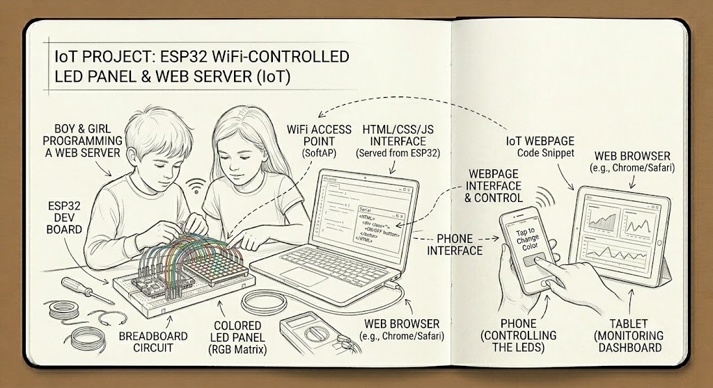
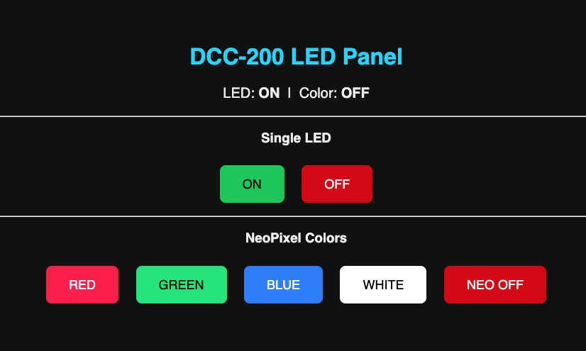

# Course Design: WiFi-Controlled LED Panel
  
This project introduces students to the Internet of Things (IoT) by transforming their smartphone into a remote control for physical hardware. By turning the ESP32 into a web server, students bridge the gap between digital software interfaces and physical light control.

---

### Course Goal

To empower students to build a functional, web-enabled hardware device. The primary goal is to demystify how websites interact with physical objects, moving from local circuit control to network-based remote access.

---

### What Students Will Learn

* **IoT Architecture:** Understanding how the microcontroller (ESP32) acts as a server to receive requests from a client (the phone).
* **Networking Basics:** Concepts of IP addresses, HTTP requests (GET/POST), and why the ESP32 needs to connect to a local WiFi network.
* **HTML/CSS Fundamentals:** Writing a minimal web page directly within the Python firmware to serve as the user interface.
* **Web-to-Hardware Bridge:** How to parse a URL request (e.g., `/on` or `/off`) and map it to a specific Digital GPIO pin on the ESP32.
* **Concurrency & Loop Management:** Ensuring the web server remains responsive without blocking the main execution loop.

---

### List Items Needed

* **Microcontroller:** ESP32 development board (with integrated WiFi).
* **LED Components:** * RGB LED strip (WS2812B/NeoPixel) or individual colored LEDs with appropriate resistors.
* **Prototyping:** Breadboard and jumper wires.
* **Development Environment:** Laptop with Arduino IDE or VS Code/PlatformIO installed.
* **Power Source:** USB cable (for programming and power).
* **Network:** Access to a local WiFi network (SSID/Password).

---

### Example Usage & Applications

* **Smart Home Prototype:** A foundational project for controlling home lighting remotely via a smartphone.
* **Event Signaling:** Using the web interface to trigger lights for specific notifications, such as a "Do Not Disturb" sign for a bedroom door.
* **Color-Coded Status Monitor:** Using an RGB panel to visually indicate server health, room temperature, or even the status of a download on a laptop.
* **Interactive Art:** Creating a web-controlled light sculpture where users can change the room's ambiance through a browser.


# USER Inrface (from ESP32 chipset)  
  
# APPENDIX  
```# DCC-200: WiFi-Controlled LED Panel
# MicroPython | Thonny | ESP32
# Web server runs on port [localip]:8080
# Supports: single LED (GPIO) and NeoPixel RGB strip (optional homework, we will do only with a single LED))

import network
import socket
import machine
import neopixel
import time

# ─────────────────────────────────────────
# CONFIGURATION — edit these before running
# ─────────────────────────────────────────
WIFI_SSID     = "FBIHQ"
WIFI_PASSWORD = "iforgot"
PORT          = 8080

LED_PIN       = 18      # or PIN 23 Onboard or single LED GPIO pin
NEO_PIN       = 4       # NeoPixel data pin
NEO_COUNT     = 8       # Number of NeoPixels on your strip

# ─────────────────────────────────────────
# HARDWARE SETUP
# ─────────────────────────────────────────
led = machine.Pin(LED_PIN, machine.Pin.OUT)
np  = neopixel.NeoPixel(machine.Pin(NEO_PIN), NEO_COUNT)

def neo_set(r, g, b):
    for i in range(NEO_COUNT):
        np[i] = (r, g, b)
    np.write()

def neo_off():
    neo_set(0, 0, 0)

# ─────────────────────────────────────────
# WIFI CONNECTION
# ─────────────────────────────────────────
def connect_wifi():
    wlan = network.WLAN(network.STA_IF)
    wlan.active(True)
    wlan.connect(WIFI_SSID, WIFI_PASSWORD)
    print("Connecting to WiFi", end="")
    for _ in range(20):
        if wlan.isconnected():
            break
        print(".", end="")
        time.sleep(0.5)
    if wlan.isconnected():
        ip = wlan.ifconfig()[0]
        print(f"\nConnected! IP: {ip}  Port: {PORT}")
        print(f"Open browser: http://{ip}:{PORT}")
        return ip
    else:
        print("\nFailed to connect to WiFi.")
        return None

# ─────────────────────────────────────────
# HTML PAGE
# ─────────────────────────────────────────
def html_page(status, color):
    return f"""HTTP/1.1 200 OK\r\nContent-Type: text/html\r\n\r\n
<!DOCTYPE html>
<html>
<head>
  <meta name="viewport" content="width=device-width, initial-scale=1">
  <title>DCC-200 LED Panel</title>
  <style>
    body  {{ font-family: sans-serif; text-align: center; background: #111; color: #eee; padding: 40px; }}
    h1    {{ color: #00d4ff; }}
    .btn  {{ display: inline-block; margin: 10px; padding: 16px 32px;
             font-size: 18px; border: none; border-radius: 8px; cursor: pointer; text-decoration: none; }}
    .on   {{ background: #00c853; color: #000; }}
    .off  {{ background: #d50000; color: #fff; }}
    .red  {{ background: #ff1744; color: #fff; }}
    .grn  {{ background: #00e676; color: #000; }}
    .blu  {{ background: #2979ff; color: #fff; }}
    .wht  {{ background: #ffffff; color: #000; }}
    .status {{ font-size: 20px; margin: 20px; }}
  </style>
</head>
<body>
  <h1>DCC-200 LED Panel</h1>
  <p class="status">LED: <strong>{status}</strong> &nbsp;|&nbsp; Color: <strong>{color}</strong></p>
  <hr>
  <h3>Single LED</h3>
  <a class="btn on"  href="/on">ON</a>
  <a class="btn off" href="/off">OFF</a>
  <hr>
  <h3>NeoPixel Colors</h3>
  <a class="btn red" href="/red">RED</a>
  <a class="btn grn" href="/green">GREEN</a>
  <a class="btn blu" href="/blue">BLUE</a>
  <a class="btn wht" href="/white">WHITE</a>
  <a class="btn off" href="/neo_off">NEO OFF</a>
</body>
</html>"""

# ─────────────────────────────────────────
# WEB SERVER
# ─────────────────────────────────────────
def start_server(ip):
    s = socket.socket(socket.AF_INET, socket.SOCK_STREAM)
    s.setsockopt(socket.SOL_SOCKET, socket.SO_REUSEADDR, 1)
    s.bind((ip, PORT))
    s.listen(5)
    print(f"Server listening on {ip}:{PORT}")

    led_status = "OFF"
    neo_color  = "OFF"

    while True:
        try:
            conn, addr = s.accept()
            request = conn.recv(1024).decode("utf-8")
            print("Request from:", addr)

            # Parse the URL path
            path = "/"
            if "GET " in request:
                path = request.split("GET ")[1].split(" ")[0]

            # Route handling
            if path == "/on":
                led.value(1)
                led_status = "ON"
            elif path == "/off":
                led.value(0)
                led_status = "OFF"
            elif path == "/red":
                neo_set(255, 0, 0)
                neo_color = "Red"
            elif path == "/green":
                neo_set(0, 255, 0)
                neo_color = "Green"
            elif path == "/blue":
                neo_set(0, 0, 255)
                neo_color = "Blue"
            elif path == "/white":
                neo_set(255, 255, 255)
                neo_color = "White"
            elif path == "/neo_off":
                neo_off()
                neo_color = "OFF"

            # Send response
            conn.send(html_page(led_status, neo_color).encode())
            conn.close()

        except Exception as e:
            print("Error:", e)
            try:
                conn.close()
            except:
                pass

# ─────────────────────────────────────────
# MAIN
# ─────────────────────────────────────────
neo_off()
led.value(0)

ip = connect_wifi()
if ip:
    start_server(ip)
```

