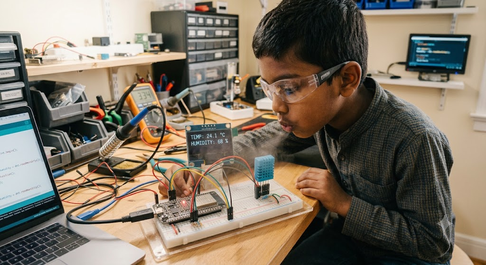

# 🌡️ Build a Weather Buddy with the ESP32

### Read the temperature and humidity of your room using a tiny sensor!

---

## 🎯 The Goal

By the end of this project, your ESP32 will become a little **weather reporter**. Every couple of seconds it will check the air around you and print out two things:

1. **Temperature** (how hot or cold the air is)
2. **Humidity** (how much water is hiding in the air)

We use a small blue sensor called the **DHT11** to do the sniffing. Think of it this way: the **ESP32 is the brain**, and the **DHT11 is its weather nose**. The brain asks "How does the air feel?" and the nose answers.

---

## 🧠 What You Will Learn

By building this, you will learn how to:

- ✅ Connect a sensor to the ESP32 using just three wires
- ✅ Use MicroPython's built-in `dht` helper to talk to a sensor
- ✅ Make a program that repeats forever using a **loop**
- ✅ Turn Celsius into Fahrenheit with a little math
- ✅ Catch errors so your program doesn't crash (a "safety net")
- ✅ Understand what temperature and humidity actually mean

---

## 💧 Wait... What Is Humidity?

Great question! Let's break it down.

The air around you is not just empty space. It is full of tiny, invisible water droplets floating around. You can't see them, but they are there. **Humidity** is a way of measuring **how much water is in the air**.

- When there is **a lot** of water in the air, we say the humidity is **high**. The air feels sticky, warm, and heavy. (Think of a steamy bathroom after a hot shower. 🚿)
- When there is **a little** water in the air, we say the humidity is **low**. The air feels dry. Your lips might get chapped and you might feel a static "zap" when you touch a doorknob. ⚡

Humidity is measured as a **percent**, from 0% to 100%:

- **0%** would mean the air is completely dry (this almost never happens!)
- **100%** means the air is totally full of water and can't hold any more. That's when you get fog or rain. 🌧️
- Most comfy rooms sit somewhere around **40% to 60%**.

> 🧪 **Try it later:** When your project is running, **breathe gently on the sensor**. Your breath is full of water, so you'll watch the humidity number climb up. You just made it "rain" on your sensor!

---

## 🧰 What You Need

- 1 × ESP32 board (the brain)
- 1 × DHT11 sensor (the blue weather nose)
- 3 × jumper wires
- A USB cable to connect the ESP32 to your computer

> 💡 **How do I know I have a DHT11?** The DHT11 is usually **blue** and a little smaller. Its cousin the DHT22 is usually **white** and a bit bigger. They look almost the same, but they need slightly different code, so double-check the color!

---

## 🔌 Wiring It Up

The DHT11 needs **three connections**: power, ground, and data. Here's the simple version:

| DHT11 pin | What it does | Connect it to the ESP32... |
|-----------|--------------|----------------------------|
| **VCC / +** | Gives it power | **3V3** pin |
| **DATA / OUT** | Sends the numbers | **GPIO 4** |
| **GND / -** | Completes the circuit | **GND** pin |

Think of it like a flashlight: power goes in one side (VCC), comes out the other (GND), and the DATA wire is how the sensor "talks" to the brain.

> ⚠️ **Super important:** Use the **3V3** pin, NOT the 5V pin. The ESP32 is happiest at 3.3 volts. Giving it 5V is like pouring too much juice into a small cup. Messy!

---

## 💻 The Code

Copy this into Thonny and save it onto your ESP32. Every line has a comment (the part after the `#`) that explains exactly what it does.

```python
# ---- STEP 1: Get our tools out of the backpack ----
from machine import Pin   # Lets us talk to the ESP32's pins
import dht                # The helper that knows how to speak "DHT sensor"
import time              # Lets us make the program pause and wait

# ---- STEP 2: Wake up the sensor ----
# We tell the ESP32: "There's a DHT11 plugged into pin 4.
# From now on, let's just call it 'sensor'."
sensor = dht.DHT11(Pin(4))

# ---- STEP 3: Do this forever (over and over again) ----
while True:

    # 'try' means: "Attempt to do this, but be ready if it goes wrong."
    try:
        sensor.measure()               # Tell the nose: "Sniff the air right now!"

        temp_c = sensor.temperature()  # Ask: "How warm is it?" (in Celsius)
        hum    = sensor.humidity()     # Ask: "How much water is in the air?" (percent)

        # The sensor speaks Celsius. This math turns it into Fahrenheit.
        temp_f = temp_c * 9 / 5 + 32

        # Print a neat weather report on the screen.
        # The {:.1f} part rounds each number to 1 decimal place,
        # so we see 23.4 instead of 23.41857
        print("🌡️ Temp: {:.1f} C / {:.1f} F   💧 Humidity: {:.1f} %".format(
            temp_c, temp_f, hum))

    # If the sensor doesn't answer (maybe a wire wiggled loose),
    # we land here instead of crashing the whole program.
    except OSError:
        print("😴 Couldn't read the sensor. Let me try again...")

    # The DHT11 is a little slow and needs a rest.
    # Wait 2 seconds before checking the air again.
    time.sleep(2)
```
## ThingsSpeak
```
# ---- STEP 1: Get our tools out of the backpack ----
from machine import Pin   # Lets us talk to the ESP32's pins
import dht                # The helper that knows how to speak "DHT sensor"
import time              # Lets us make the program pause and wait
import network, urequests

# ---- STEP 2: Wake up the sensor ----
# We tell the ESP32: "There's a DHT11 plugged into pin 4.
# From now on, let's just call it 'sensor'."
sensor = dht.DHT11(Pin(4))
# wifi setup

wifi = network.WLAN(network.STA_IF)
wifi.active(True)
wifi.connect("WiFiNAME", "WiFiPass")
while not wifi.isconnected():
    time.sleep(1)

# Thingsspeak.com API
# visualize at https://thingspeak.mathworks.com/channels/3424736

KEY = "HQJ0ECXF9IU4W6LY"

# ---- STEP 3: Do this forever (over and over again) ----
while True:

    # 'try' means: "Attempt to do this, but be ready if it goes wrong."
    try:
        sensor.measure()               # Tell the nose: "Sniff the air right now!"

        temp_c = sensor.temperature()  # Ask: "How warm is it?" (in Celsius)
        hum    = sensor.humidity()     # Ask: "How much water is in the air?" (percent)

        # The sensor speaks Celsius. This math turns it into Fahrenheit.
        temp_f = temp_c * 9 / 5 + 32

        # Print a neat weather report on the screen.
        # The {:.1f} part rounds each number to 1 decimal place,
        # so we see 23.4 instead of 23.41857
        print("🌡️ Temp: {:.1f} C / {:.1f} F   💧 Humidity: {:.1f} %".format(
            temp_c, temp_f, hum))
        
        url = "https://api.thingspeak.com/update?api_key={}&field1={}&field2={}".format(KEY, temp_f, hum)
        r = urequests.get(url)
        r.close()
        time.sleep(15)
    # If the sensor doesn't answer (maybe a wire wiggled loose),
    # we land here instead of crashing the whole program.
    except OSError:
        print("😴 Couldn't read the sensor. Let me try again...")

    # The DHT11 is a little slow and needs a rest.
    # Wait 2 seconds before checking the air again.
    time.sleep(2)
```
> 🧠 **Golden rule:** Always run your code from the **top to the bottom**, in order. Computers read code the same way you read a story: one line at a time, from the top!

---

## 🎉 What You Should See

Open the Thonny shell, and every 2 seconds a fresh line pops up:

```
🌡️ Temp: 26.0 C / 78.8 F   💧 Humidity: 50.0 %
🌡️ Temp: 26.0 C / 78.8 F   💧 Humidity: 51.0 %
```

> 📝 **Note:** The DHT11 reports **whole numbers only** (like 26 C and 50%), so don't be surprised if you don't see fancy decimals. That's normal for this sensor. It's simple but reliable!

---

## 🛠️ Uh Oh, It's Not Working?

| What you see | What's probably wrong | How to fix it |
|--------------|----------------------|---------------|
| Huge crazy numbers like `665 C` | Your code says `DHT22` but you have a `DHT11` | Change the code to `dht.DHT11(Pin(4))` |
| `ETIMEDOUT` error | A wire is loose, or you're reading too fast | Check your wires and keep the 2 second wait |
| All readings fail | Power on the wrong pin | Make sure VCC is on **3V3**, not 5V |
| Nothing prints at all | Code didn't run top to bottom | Re-run the whole program from the start |

---

## 🚀 Challenge Time!

Once your Weather Buddy works, level up:

1. **Comfort checker:** Add an `if` statement that prints `"Too hot! 🥵"` when the temperature goes above 28 C.
2. **Humidity alarm:** Print `"It's getting steamy! 💦"` when humidity climbs over 60%.
3. **Slow it down:** Change `time.sleep(2)` to `time.sleep(5)` and watch the readings arrive slower.
4. **Make it rain:** Breathe on the sensor and write down how high you can push the humidity number!



Have fun, weather scientists! 🌦️

---

Optional Homework

Want to go further with this? Check out
[optional_homework_dcc-400.md](./optional_homework_dcc-400.md) for some
extra practice. It's optional, so don't worry if you don't get to it,
but it's there if you want more of a challenge.
