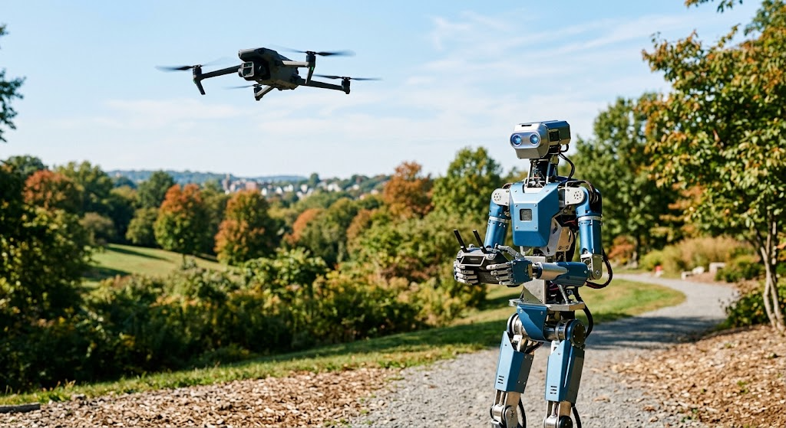

# DCC-401: Sensing and Acting (IMU + Servo Foundations)



This core lesson has two short builds. First, students read board tilt with an IMU. Second, students move a servo to exact angles. Splitting these ideas makes robotics easier to understand.

## Core Flow (same in every DCC core lesson)

1. Build the circuit.
2. Run the starter code.
3. Observe what changes in real life.
4. Explain the concept in plain words.
5. Try a challenge.

## Big Idea

Robots follow a loop: Sense -> Decide -> Act. In this lesson, students master Sense and Act separately before combining them in DCC-501.

## What You Will Build

1. IMU reader (prints roll angle)
2. Servo mover (0, 90, 180 degrees)

## What You Will Learn

- How I2C sensors connect and communicate
- How raw acceleration becomes a tilt angle
- How PWM controls servo position
- Why independent testing prevents complex bugs

## Parts Needed

| Part | Qty |
| --- | --- |
| ESP32 dev board | 1 |
| MPU-6500 or MPU-9250 module | 1 |
| SG90 servo | 1 |
| Jumper wires | 1 set |
| USB cable | 1 |

## Wiring A: IMU (Sense)

| IMU pin | ESP32 pin |
| --- | --- |
| VCC | 3V3 |
| GND | GND |
| SDA | GPIO 21 |
| SCL | GPIO 22 |

## Starter Code A: IMU Roll Reader

```python
from machine import Pin, I2C   # I2C is a way to talk to a sensor using 2 wires
import time
import math                    # gives us math tools like atan2 for angles

i2c = I2C(0, scl=Pin(22), sda=Pin(21))   # set up the 2-wire chat on pins 22 and 21
MPU_ADDR = 0x68               # the sensor's "phone number" on the I2C line

# Wake up sensor
i2c.writeto_mem(MPU_ADDR, 0x6B, b'\x00')   # the sensor starts asleep; this wakes it up

def read_raw_accel():         # reads how gravity is pulling in 3 directions
    data = i2c.readfrom_mem(MPU_ADDR, 0x3B, 6)   # grab 6 bytes of raw numbers
    ax = (data[0] << 8) | data[1]   # join 2 bytes into the X number
    ay = (data[2] << 8) | data[3]   # join 2 bytes into the Y number
    az = (data[4] << 8) | data[5]   # join 2 bytes into the Z number
    # the sensor uses a trick for negative numbers; these lines fix that
    if ax > 32767: ax -= 65536
    if ay > 32767: ay -= 65536
    if az > 32767: az -= 65536
    return ax, ay, az         # hand back all three numbers

while True:
    ax, ay, az = read_raw_accel()          # read the gravity numbers
    roll = math.atan2(ax, az) * 180 / math.pi   # turn them into a tilt angle in degrees
    print("Roll: {:.1f} deg".format(roll))      # show the angle
    time.sleep(0.2)           # small pause so the numbers don't fly by too fast
```

## Wiring B: Servo (Act)

| Servo wire | ESP32 pin |
| --- | --- |
| Signal (orange/yellow) | GPIO 19 |
| VCC (red) | 5V |
| GND (brown/black) | GND |

If you use external power for the servo, share ground with ESP32.

## Starter Code B: Servo Angles

```python
from machine import Pin, PWM   # PWM sends the timed pulses a servo listens to
import time

servo = PWM(Pin(19), freq=50)   # servos expect 50 pulses per second on pin 19

def angle_to_duty(angle):       # turns an angle (0-180) into a pulse the servo understands
    min_duty = 40               # the pulse size for 0 degrees
    max_duty = 115              # the pulse size for 180 degrees
    # pick a pulse size somewhere between min and max based on the angle
    return int(min_duty + (angle / 180) * (max_duty - min_duty))

def move_to(angle):             # a helper to move the servo to an angle
    servo.duty(angle_to_duty(angle))   # send the matching pulse
    print("Servo ->", angle)    # show where we told it to go

while True:
    move_to(0)                  # point fully one way
    time.sleep(1)               # hold for 1 second
    move_to(90)                 # point to the middle
    time.sleep(1)
    move_to(180)                # point fully the other way
    time.sleep(1)
```

## Explain the Concept

- IMU gives orientation data (sense).
- Servo receives position commands (act).
- Robotics gets easier when each half works alone first.

## Try It Now

- IMU: print `ax`, `ay`, `az` with roll.
- Servo: sweep smoothly from 0 to 180 one degree at a time.
- Discuss where this loop appears in drones and self-balancing robots.

## Session Plan (90 minutes)

| Time | Activity |
| --- | --- |
| 0:00 - 0:10 | Hook and Big Idea: Sense -> Decide -> Act |
| 0:10 - 0:30 | Build A (IMU) and run the roll reader |
| 0:30 - 0:45 | Tilt the board and observe the numbers change |
| 0:45 - 1:05 | Build B (servo) and run the angle sweep |
| 1:05 - 1:20 | Try It Now challenges for both halves |
| 1:20 - 1:30 | Concept check and cleanup |

## Troubleshooting

| Problem | Likely Cause | Fix |
| --- | --- | --- |
| No IMU data | SDA/SCL swapped | Recheck GPIO 21/22 wiring |
| IMU values frozen | Sensor asleep | Keep wake-up write to 0x6B |
| Servo jitters | Weak power or bad ground | Use stronger 5V supply and shared GND |
| ESP32 resets on servo move | Servo drawing too much current | Power servo separately |

## Quick Concept Check

1. What is the difference between Sense and Act?
2. Why do we use PWM for servo control?
3. Why is testing each half separately helpful?

## Optional Homework

Build a simple combined loop in [optional_homework_dcc-400.md](./optional_homework_dcc-400.md).
