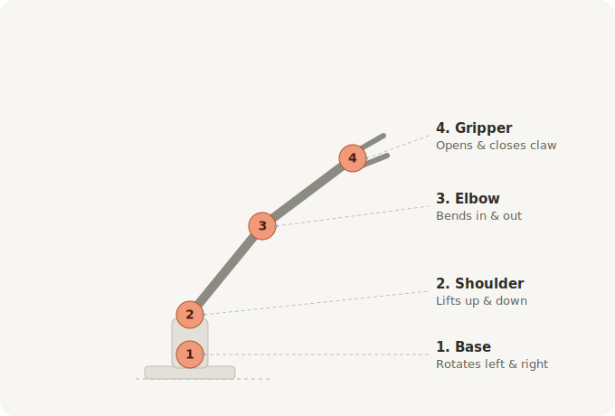

# DCC-501: Robotics Capstone (Sense -> Decide -> Act)



This is the core capstone lesson. Students combine sensing and acting in one program so the robot responds to motion in real time.

## Core Flow (same in every DCC core lesson)

1. Build the circuit.
2. Run the starter code.
3. Observe what changes in real life.
4. Explain the concept in plain words.
5. Try a challenge.

## Big Idea

A complete robot repeatedly does three jobs: sense the world, decide what to do, and act with motors. In this capstone, wrist tilt becomes servo movement.

## What You Will Build

A one-board reactive system:

- MPU sensor reads tilt angle
- ESP32 maps tilt to target angle
- SG90 servo mirrors that tilt

## What You Will Learn

- How to combine multiple hardware blocks in one loop
- How mapping converts sensor range to motor range
- How clamping protects hardware from invalid values
- How to tune responsiveness for stable motion

## Parts Needed

| Part | Qty |
| --- | --- |
| ESP32 dev board | 1 |
| MPU-6500 or MPU-9250 | 1 |
| SG90 servo | 1 |
| Jumper wires | 1 set |
| USB cable | 1 |

## Wiring

IMU wiring:

| IMU pin | ESP32 pin |
| --- | --- |
| VCC | 3V3 |
| GND | GND |
| SDA | GPIO 21 |
| SCL | GPIO 22 |

Servo wiring:

| Servo wire | ESP32 pin |
| --- | --- |
| Signal | GPIO 19 |
| VCC | 5V |
| GND | GND |

## Starter Code

```python
from machine import Pin, I2C, PWM   # I2C talks to the sensor, PWM drives the servo
import time
import math

# IMU setup (the SENSE part)
i2c = I2C(0, scl=Pin(22), sda=Pin(21))   # 2-wire chat with the sensor on pins 22 and 21
MPU_ADDR = 0x68                          # the sensor's address on the I2C line
i2c.writeto_mem(MPU_ADDR, 0x6B, b'\x00')  # wake the sensor up (it starts asleep)

# Servo setup (the ACT part)
servo = PWM(Pin(19), freq=50)            # servo listens for 50 pulses per second on pin 19

def angle_to_duty(angle):                # turn an angle (0-180) into a servo pulse
    min_duty = 40                        # pulse for 0 degrees
    max_duty = 115                       # pulse for 180 degrees
    return int(min_duty + (angle / 180) * (max_duty - min_duty))

def clamp(value, low, high):             # keep a number from going out of range
    if value < low:                      # too small? snap it up to the lowest allowed
        return low
    if value > high:                     # too big? snap it down to the highest allowed
        return high
    return value                         # otherwise leave it alone

def read_roll_deg():                     # read the board's tilt as an angle
    data = i2c.readfrom_mem(MPU_ADDR, 0x3B, 6)   # grab the raw gravity numbers
    ax = (data[0] << 8) | data[1]        # build the X number from 2 bytes
    az = (data[4] << 8) | data[5]        # build the Z number from 2 bytes
    if ax > 32767: ax -= 65536           # fix negative numbers
    if az > 32767: az -= 65536
    return math.atan2(ax, az) * 180 / math.pi   # turn it into degrees of tilt

while True:
    roll = read_roll_deg()               # SENSE: how tilted are we?

    # DECIDE: change a tilt of -45..45 degrees into a servo angle of 0..180
    mapped = int((roll + 45) * 180 / 90)
    target = clamp(mapped, 0, 180)       # keep the servo angle safely inside 0-180

    servo.duty(angle_to_duty(target))    # ACT: move the servo to match your tilt
    print("roll={:.1f} -> servo={}".format(roll, target))   # show both numbers
    time.sleep(0.05)                     # tiny pause so it reacts smoothly and fast
```

## Explain the Concept

- Sense: IMU gives tilt.
- Decide: mapping converts tilt to an angle command.
- Act: servo moves to that command.

This is a complete robotics feedback pipeline.

## Try It Now

- Change mapping from `-45..45` to `-30..30` for more sensitivity.
- Add smoothing with a moving average of last 5 roll readings.
- Add a dead zone of plus/minus 3 degrees to reduce jitter.

## Session Plan (90 minutes)

| Time | Activity |
| --- | --- |
| 0:00 - 0:10 | Recap Sense -> Decide -> Act from DCC-401 |
| 0:10 - 0:30 | Wire both IMU and servo on one board |
| 0:30 - 0:50 | Run the starter code and tilt to move the servo |
| 0:50 - 1:10 | Try It Now: change mapping, add smoothing |
| 1:10 - 1:20 | Concept check |
| 1:20 - 1:30 | Cleanup and discuss extension tracks |

## Troubleshooting

| Problem | Likely Cause | Fix |
| --- | --- | --- |
| Servo slams to one side | Wrong mapping range | Print roll values and recalculate range |
| Jittery servo | Noisy sensor signal | Add smoothing and dead zone |
| No IMU response | Wrong I2C wiring | Recheck SDA/SCL and power |
| Random resets | Servo current spikes | Use external servo power with shared GND |

## Quick Concept Check

1. Which part of code is Sense?
2. Which part is Decide?
3. Why do we clamp servo angles between 0 and 180?

## Extension Path

After this capstone, students can branch into optional tracks:

- Multi-servo arm control
- Wireless ESP-NOW sender/receiver
- Advanced telemetry dashboards
